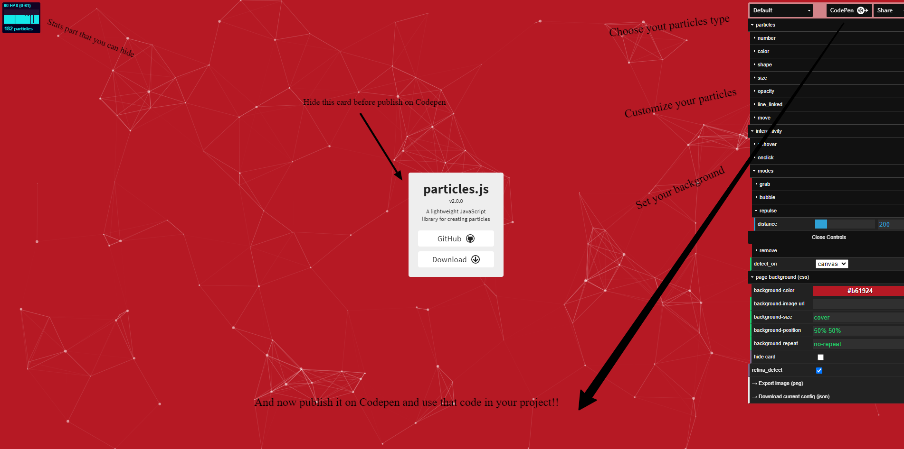

## Particles.js

Today I had a little taste of the power of the canvas concept. I chose to use a really beautiful library: [Particle.Js](https://vincentgarreau.com/particles.js/)      
It was a very exciting experiment. My demo is really essential but I realized that it has an immense potential for projects in which you want to make the most of design as an art form to communicate and to create different... atmosphere.    

    

After all, the concept of canvas is nothing more than an explicit reference to a white canvas that can be filled with what we want...   
So, with Particle.Js it is really simple to have in your hands working code, stable, clean, customizable.

Simply edit your canvas from the tool that Vincent Garreau (Particle.Js author) made available and publish it on Codepen. From here you can use the Javascript, Css and HTML parts in your project.    
The rest is built within the div that hosts the canvas.   
You can set all the settings related to the number of items you want, the interactions on hover, on click and the ways in which our items must react to these events.

  

The particles are perfectly customizable and even the base of our canvas can be used with simple CSS or a background image.
Particle types can be chosen from a dropdown that offers default particles, NASA, Bubble, Snow, Nyan Cat.   

Particle.Js has 24,899 stars at the moment (including mine!) and 282 issues and 4,400 forks and is licensed under MIT.

1) Include [CDN library](https://www.jsdelivr.com/package/npm/particles.js) in you HTML file and use the 

```HTML   
<div id="particles-js"></div>
```
to grab you HTML content 

2) Create you own custom particles canvas using the page tool at https://vincentgarreau.com/particles.js/ 

3) Publish it on Codepen using the Codepen button on the top right 

4) In you custom JavaScript file copy that Codepen result (same for CSS)

***

  *All the "stats" part has been deleted because i don't need to monitor particles in this demo*
